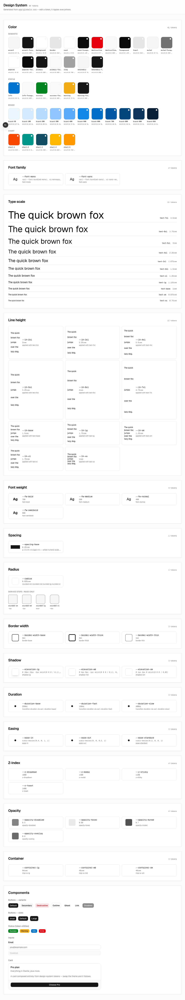
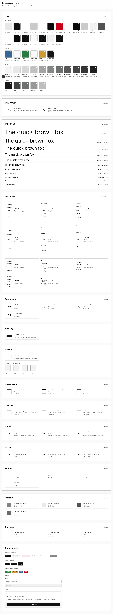
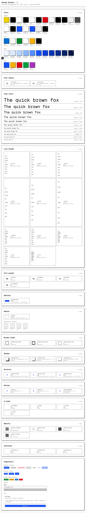

# vibe-design-system

A **design-system starter template** for building a website or SaaS app with an LLM (vibe coders).

One source of truth — CSS custom properties in `app/globals.css` — read and written by three consumers:

- **the app** renders from it,
- **a built-in visual editor** writes to it (dev-only, point-and-click),
- **the LLM** reads it to build and is held to it by a blocking lint.

You install the template, then build on it. Edits to a token ripple everywhere it's used. When the LLM
needs a value the system lacks, it extends the system (adds a token) instead of hardcoding — and the new
token auto-appears on the `/design-system` page, ready to edit.

**Stack:** Next.js (App Router) + TypeScript + Tailwind + shadcn/ui.

## Themes

Pick a look at adoption time, then fine-tune in the editor. Default is **Neutral** (already applied —
doing nothing is valid).

```bash
npm run theme neutral    # calm, professional default
npm run theme swiss      # austere, monochrome, grid + whitespace
npm run theme brutalist  # raw, thick borders, hard shadows, mono
```

`npm run theme <name>` swaps the preset's values into `app/globals.css` and regenerates the manifest.
Token **names** are the fixed contract; only values change — so every consumer (app, editor, lint, the
manifest) works unchanged. Each theme passes WCAG-AA contrast (light + dark) and renders without overflow.

| Neutral | Swiss | Brutalist |
|---|---|---|
|  |  |  |

_(Five more — Editorial, Warm, Pastel, Technical, Corporate — are a fast-follow on the same machinery.)_

## Status

In progress. Design is complete and approved — see
[docs/specs/2026-06-16-design-system-starter-design.md](docs/specs/2026-06-16-design-system-starter-design.md).

Build order: ✅ M0 skeleton + naming convention → ✅ M1 token write-core → ✅ M2 manifest generation →
✅ M3 design-system page → ✅ M3a theme preset suite → M4 editor → M5 LLM contract → M6 dogfood.
